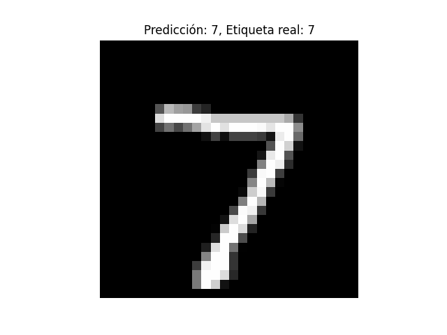
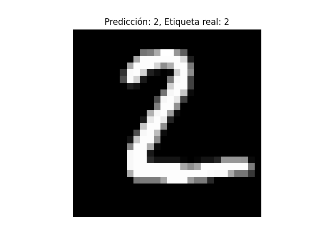
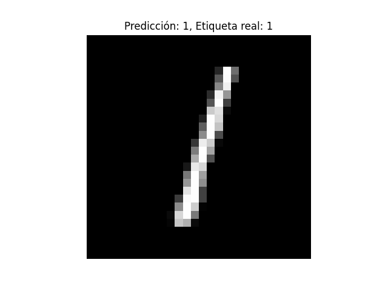
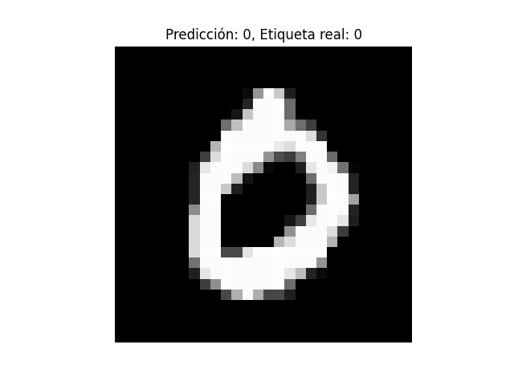
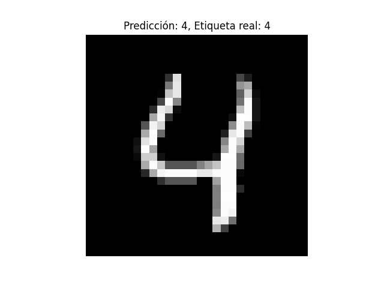

# 🧠 Reconocimiento de Dígitos con Redes Neuronales

Este proyecto es un ejemplo práctico de clasificación supervisada en Python, en el cual se implementa una red neuronal básica del tipo Multilayer Perceptron (MLP) utilizando TensorFlow y Keras para reconocer imágenes de dígitos escritos a mano (del 0 al 9), usando el dataset MNIST.

A lo largo del proyecto se muestra cómo:
- Cargar y preprocesar datos de imagen.
- Construir una red neuronal con Keras.
- Entrenar y validar el modelo.
- Evaluar su desempeño.
- Realizar predicciones y visualizar resultados.

---

## 📦 Paso 1: Importación de Librerías

En este paso se importan las librerías necesarias para llevar a cabo el proyecto:

```python
import tensorflow as tf
from tensorflow.keras import layers, models
import matplotlib.pyplot as plt
```

#### 🔍 ¿Por qué se usan estas librerías?

1. `tensorflow`

TensorFlow es una de las bibliotecas más populares para desarrollar y entrenar modelos de machine learning y deep learning. Es mantenida por Google y se usa ampliamente en la industria y en la academia.

En este proyecto usamos Keras, que es una API de alto nivel integrada dentro de TensorFlow (`tensorflow.keras`), diseñada para facilitar la construcción y entrenamiento de redes neuronales.

2. `from tensorflow.keras import layers, models`

Esta línea importa módulos específicos de Keras que nos permiten construir una red neuronal de manera sencilla.

`layers`: contiene las distintas capas que usaremos para construir la red (por ejemplo: Dense, Flatten, etc.).

`models`: nos permite crear modelos del tipo secuencial, que es el más simple (una pila lineal de capas).

3. `matplotlib.pyplot`

Esta biblioteca se usa para visualizar imágenes o gráficas. Es muy útil para mostrar ejemplos de imágenes del dataset MNIST, así como resultados de predicción del modelo.

## 📥 Paso 2: Carga del Dataset MNIST

```python
(x_train, y_train), (x_test, y_test) = tf.keras.datasets.mnist.load_data()
```

#### 🔍 ¿Qué es MNIST?

MNIST (Modified National Institute of Standards and Technology) es un dataset muy utilizado en tareas de clasificación de imágenes. Contiene 70.000 imágenes en escala de grises de dígitos escritos a mano (del 0 al 9). Cada imagen tiene un tamaño de 28x28 píxeles.

Estas imágenes vienen acompañadas de sus respectivas etiquetas (labels), que indican qué número representa cada imagen.

#### 📌 División de datos: ¿Qué son `x_train`, `y_train`, `x_test`, `y_test`?

Cuando trabajamos con aprendizaje supervisado, es fundamental dividir los datos en al menos dos conjuntos principales:

| Variable   | Contenido                                     | Propósito                        |
|------------|-----------------------------------------------|----------------------------------|
| `x_train`  | Imágenes de entrenamiento                     | Para entrenar el modelo          |
| `y_train`  | Etiquetas reales (0–9) de esas imágenes       | Para que el modelo aprenda       |
| `x_test`   | Imágenes no vistas durante el entrenamiento   | Para evaluar el modelo           |
| `y_test`   | Etiquetas reales de las imágenes de prueba    | Para comparar con predicciones   |

#### 🎯 ¿Por qué se hace esta separación?

- El modelo aprende a asociar las imágenes (`x_train`) con sus etiquetas (`y_train`) durante el entrenamiento.

- Después, se evalúa su desempeño usando `x_test` y `y_test`, que contienen datos que el modelo nunca ha visto. Así se puede medir si generaliza bien o solo memorizó los datos.

#### 🧪 ¿Y qué pasa con la validación?

Durante el entrenamiento también es importante observar cómo se comporta el modelo con datos que no está usando directamente para aprender. Para eso existe el conjunto de validación, que sirve para:

- Ajustar los parámetros del modelo (como el número de épocas, arquitectura, etc.).

- Detectar problemas como sobreajuste (overfitting).

En este proyecto, la validación se implementa más adelante en el código mediante un parámetro llamado `validation_split`, que permite reservar automáticamente una parte del conjunto de entrenamiento con este propósito. Esto se explicará en detalle más adelante.

## ⚙️ Paso 3: Normalización de las Imágenes

```python
x_train = x_train / 255.0
x_test = x_test / 255.0
```

#### 🎯 ¿Qué es la normalización?

La normalización es el proceso de escalar los valores de los datos para que estén dentro de un cierto rango, en este caso entre 0.0 y 1.0.

Cada imagen del dataset MNIST está compuesta por píxeles con valores enteros entre 0 y 255 (porque es una imagen en escala de grises). Para que la red neuronal pueda entrenarse de forma más eficiente, se normalizan dividiendo cada valor de píxel entre 255.0.

#### ✅ ¿Por qué es importante?

- Las redes neuronales trabajan mejor cuando los datos de entrada tienen un rango uniforme y pequeño.

- Mejora la velocidad de entrenamiento y la estabilidad numérica.

- Ayuda a que las funciones de activación (como ReLU o sigmoid) funcionen correctamente.

Nota: Esta normalización solo afecta los datos de entrada (`x_train`, `x_test`), no las etiquetas (`y_train`, `y_test`), ya que estas son categorías del 0 al 9.

## 🏗️ Paso 4: Creación del Modelo de Red Neuronal

```python
model = models.Sequential([
    layers.Flatten(input_shape=(28, 28)),     # Convierte 28x28 píxeles en un vector de 784
    layers.Dense(128, activation='relu'),     # Capa oculta con 128 neuronas y ReLU
    layers.Dense(10, activation='softmax')    # Capa de salida con 10 clases (0-9)
])
```

#### 🧠 ¿Qué tipo de modelo se está creando?

Se construye una red neuronal secuencial, lo que significa que las capas están conectadas una tras otra en orden.

#### 🔍 Explicación de cada capa:

| Capa                             | Función                                                                                                                                                     |
|----------------------------------|-------------------------------------------------------------------------------------------------------------------------------------------------------------|
| `Flatten(input_shape=(28, 28))`  | Convierte la imagen 2D (28x28 píxeles) en un vector de 784 valores. Esto es necesario para que los datos puedan ser procesados por las capas densas.       |
| `Dense(128, activation='relu')` | Crea una capa oculta con 128 neuronas. Se usa la función de activación ReLU (Rectified Linear Unit), que introduce no linealidad y ayuda a aprender patrones. |
| `Dense(10, activation='softmax')`| Capa de salida con 10 neuronas, una para cada dígito (0 al 9). La función softmax transforma los valores en probabilidades para cada clase.                  |

#### 🎯 ¿Por qué esta arquitectura?

- Es una red sencilla pero efectiva para un problema como MNIST.

- Usar una sola capa oculta con 128 neuronas es suficiente para lograr una precisión razonable.

- Se prioriza la claridad y la didáctica sobre el rendimiento avanzado, ya que el enfoque es de aprendizaje.

Más adelante se podrá experimentar agregando más capas, cambiando el número de neuronas o usando otras funciones de activación para ver cómo afecta al rendimiento.

## ⚙️ Paso 5: Compilar el Modelo

```python
model.compile(optimizer='adam',
              loss='sparse_categorical_crossentropy',
              metrics=['accuracy'])
```

#### 🧪 ¿Qué significa compilar un modelo?

Antes de entrenar una red neuronal, es necesario compilarla, lo que implica definir tres aspectos clave:

| Parámetro                         | Descripción                                                                                                                                                               |
|----------------------------------|---------------------------------------------------------------------------------------------------------------------------------------------------------------------------|
| `optimizer='adam'`               | El optimizador determina cómo se actualizan los pesos durante el entrenamiento. Adam es un algoritmo muy eficiente y popular que ajusta automáticamente la tasa de aprendizaje. |
| `loss='sparse_categorical_crossentropy'` | La función de pérdida mide qué tan mal está prediciendo el modelo. En este caso, como las etiquetas son enteros del 0 al 9 (y no one-hot), se usa `sparse_categorical_crossentropy`. |
| `metrics=['accuracy']`           | Se evalúa el desempeño del modelo utilizando la precisión (`accuracy`), es decir, el porcentaje de predicciones correctas.                                                |

## 🚀 Paso 6: Entrenar el Modelo

```python
model.fit(x_train, y_train, epochs=5, validation_split=0.1)
```

#### 🧠 ¿Qué hace fit()?

La función `fit()` entrena el modelo utilizando los datos de entrada (`x_train`) y sus etiquetas reales (`y_train`) durante un número determinado de épocas (iteraciones completas sobre los datos).

#### 📌 Detalles del entrenamiento:

| Parámetro               | Significado                                                                                                                                   |
|-------------------------|-----------------------------------------------------------------------------------------------------------------------------------------------|
| `x_train`, `y_train`    | Datos con los que el modelo va a aprender.                                                                                                   |
| `epochs=5`              | El modelo revisa todos los datos 5 veces para mejorar su desempeño.                                                                          |
| `validation_split=0.1`  | El 10% del conjunto de entrenamiento se reserva para validación, lo cual permite monitorear si el modelo generaliza bien o se está sobreajustando (*overfitting*). |

La validación no afecta el entrenamiento directamente, pero ayuda a verificar el progreso del modelo con datos que no está usando para aprender, evitando así errores por sobreajuste.

## 🧪 Paso 7: Evaluar el Modelo con el Conjunto de Prueba

```python
test_loss, test_acc = model.evaluate(x_test, y_test)
print(f'\nPrecisión del modelo en datos de prueba: {test_acc:.4f}')
```

#### 🎯 ¿Qué hace `evaluate()`?

La función `evaluate()` permite medir el rendimiento final del modelo usando datos que nunca se usaron en el entrenamiento ni en la validación. Esto proporciona una estimación realista de cómo funcionará el modelo con datos nuevos.

#### 📌 Detalles de la evaluación:

| Comando                        | Significado                                                                                                                     |
|-------------------------------|---------------------------------------------------------------------------------------------------------------------------------|
| `model.evaluate(x_test, y_test)` | Evalúa el modelo con imágenes de prueba y devuelve dos valores: la **pérdida** (`loss`) y la **precisión** (`accuracy`).       |
| `test_loss`                   | Indica qué tan mal se desempeñó el modelo en términos de pérdida.                                                               |
| `test_acc`                    | Muestra la precisión obtenida en el conjunto de prueba (porcentaje de clasificaciones correctas).                               |

Esta etapa es fundamental para entender si el modelo realmente aprendió o simplemente memorizó los datos de entrenamiento. Una alta precisión en prueba sugiere que el modelo generaliza bien.

#### 🧾 Resultado obtenido:

```python
Precisión del modelo en datos de prueba: 0.9766
```

#### 📈 ¿Qué significa ese valor?

Una precisión de 0.9766 (o 97.66%) indica que el modelo acertó en casi el 98% de los casos al clasificar dígitos escritos a mano que nunca había visto antes.

✅ Esto sugiere que el modelo generaliza muy bien y es bastante confiable para este tipo de tarea.

## 🔍 Paso 8: Hacer Predicciones y Visualizar Resultados

```python
predictions = model.predict(x_test)

# Mostrar 5 ejemplos de predicción
for i in range(5):
    plt.imshow(x_test[i], cmap='gray')
    plt.title(f'Predicción: {predictions[i].argmax()}, Etiqueta real: {y_test[i]}')
    plt.axis('off')
    plt.show()
```

#### 🧠 ¿Qué hace este bloque de código?

- Se generan predicciones con el modelo ya entrenado usando el conjunto de prueba (`x_test`).

- Se muestran las primeras 5 imágenes junto con:

  - La predicción del modelo (`predictions[i].argmax()`)

  - La etiqueta real (`y_test[i]`)

- Esto permite ver visualmente cómo está funcionando el modelo.

#### Ejemplos de predicciones del modelo







## 📄 Licencia

Este proyecto está bajo la Licencia MIT - consulta el archivo [LICENSE](https://github.com/Carturo8/Digit-Recognition-NN/blob/main/LICENSE) para más detalles.
